# Prokurimi

- [Prokurimi](#prokurimi)
  - [Hyrje](#hyrje)
    - [Qëllimi i dokumentit](#q%C3%ABllimi-i-dokumentit)
    - [Vlefshmëria e dokumentit](#vlefshm%C3%ABria-e-dokumentit)
    - [Definimi i termeve dhe shkurtesave](#definimi-i-termeve-dhe-shkurtesave)
    - [Relacionet me dokumentet tjera](#relacionet-me-dokumentet-tjera)
    - [Pasqyra e dokumentit](#pasqyra-e-dokumentit)
  - [Përshkrimi i përgjithshëm i sistemit të kërkuar](#p%C3%ABrshkrimi-i-p%C3%ABrgjithsh%C3%ABm-i-sistemit-t%C3%AB-k%C3%ABrkuar)
    - [Relacioni me projektet ekzistuese](#relacioni-me-projektet-ekzistuese)
    - [Qëllimi i sistemit të kërkuar](#q%C3%ABllimi-i-sistemit-t%C3%AB-k%C3%ABrkuar)
    - [Kufizimet dhe inkorporimi I produktit](#kufizimet-dhe-inkorporimi-i-produktit)
    - [Përmbledhje e funksionalitetit të kërkuar](#p%C3%ABrmbledhje-e-funksionalitetit-t%C3%AB-k%C3%ABrkuar)
    - [Kufizimet e përgjithshme](#kufizimet-e-p%C3%ABrgjithshme)
    - [Specifikimet Harduerike dhe Softuerike](#specifikimet-harduerike-dhe-softuerike)
      - [Specifikimet harduerike](#specifikimet-harduerike)
    - [Specifikimet softuerike](#specifikimet-softuerike)
    - [Specifikimet fizike](#specifikimet-fizike)
    - [Shfrytëzuesit e sistemit të kërkuar](#shfryt%C3%ABzuesit-e-sistemit-t%C3%AB-k%C3%ABrkuar)
  - [Përshkrimi i detajuar i sistemit](#p%C3%ABrshkrimi-i-detajuar-i-sistemit)
    - [Fusha e dorëzimit](#fusha-e-dor%C3%ABzimit)
    - [Skenarët e interaksioneve me rrethinën](#skenar%C3%ABt-e-interaksioneve-me-rrethin%C3%ABn)
    - [Pritjet e përdoruesit](#pritjet-e-p%C3%ABrdoruesit)
    - [Funksionet e kërkuara nga sistemi](#funksionet-e-k%C3%ABrkuara-nga-sistemi)
      - [Kërkesat funksionale](#k%C3%ABrkesat-funksionale)
      - [Kërkesat jofunksionale](#k%C3%ABrkesat-jofunksionale)
    - [Funksionet tjera të kërkuara nga produkti](#funksionet-tjera-t%C3%AB-k%C3%ABrkuara-nga-produkti)
      - [Performanca e sistemit](#performanca-e-sistemit)
      - [Siguria](#siguria)
      - [Portabiliteti](#portabiliteti)
      - [Besueshmëria](#besueshm%C3%ABria)
      - [Mirëmbajtja](#mir%C3%ABmbajtja)
      - [Ripërdorimi](#rip%C3%ABrdorimi)
      - [Përdorueshmëria](#p%C3%ABrdorueshm%C3%ABria)
    - [Modeli i domenit](#modeli-i-domenit)
    - [Skenarët e interaksionit (use case)](#skenar%C3%ABt-e-interaksionit-use-case)
      - [Përshkrimi për use case 1](#p%C3%ABrshkrimi-p%C3%ABr-use-case-1)
      - [Përshkrimi për use case 2](#p%C3%ABrshkrimi-p%C3%ABr-use-case-2)
      - [Përshkrimi për use case 3](#p%C3%ABrshkrimi-p%C3%ABr-use-case-3)
      - [Përshkrimi për use case 4](#p%C3%ABrshkrimi-p%C3%ABr-use-case-4)
      - [Përshkrimi për use case 5](#p%C3%ABrshkrimi-p%C3%ABr-use-case-5)
      - [Përshkrimi për use case 6](#p%C3%ABrshkrimi-p%C3%ABr-use-case-6)
      - [Përshkrimi për use case 7](#p%C3%ABrshkrimi-p%C3%ABr-use-case-7)
      - [Përshkrimi për use case 8](#p%C3%ABrshkrimi-p%C3%ABr-use-case-8)
    - [Kërkesat e klientit për menaxhimin e projektit](#k%C3%ABrkesat-e-klientit-p%C3%ABr-menaxhimin-e-projektit)
    - [Kërkesat e implementimit](#k%C3%ABrkesat-e-implementimit)
    - [Komponentet e gatshme dhe ato të blera](#komponentet-e-gatshme-dhe-ato-t%C3%AB-blera)
    - [Nënkontraktimi](#n%C3%ABnkontraktimi)
    - [Kushtet e pranimit](#kushtet-e-pranimit)
    - [Kushtet e dorëzimit](#kushtet-e-dor%C3%ABzimit)
    - [Garancia](#garancia)
  - [Obligimet e klientit](#obligimet-e-klientit)
    - [Planifikimi i resurseve](#planifikimi-i-resurseve)
    - [Planifikimi i buxhetit](#planifikimi-i-buxhetit)
  

## Hyrje

### Qëllimi i dokumentit

Qëllimi i këtij dokumenti është përshkrimi i kërkesave të shfrytëzuesit të këtij sistemi, përkatësisht termave të referencës të cilat shërbejnë për zhvillimin e sistemit.

### Vlefshmëria e dokumentit

Ky dokument është i vlefshëm vetëm gjatë procesimit të kontraktimit dhe zhvillimit të projektit.

### Definimi i termeve dhe shkurtesave

- SIMP - Sistemi Informativ i menaxhimit të Prokurimit
- AKK  - Agjensia kundër korrupsionit
- MIF  - Ministria e Financave
- FIEK - Fakulteti I Inxhinierisë Elektrike dhe Kompjuterike
- GHz  - Giga Herz
- TB   - Tera Byte
- GB   - Giba Byte
- MB   - Mega Byte
- W/h  - Watt per hour
- Gbps - Giga bits per second
- MS   - Microsoft
- SQL  - Select Query Language
- PDF  - Portable Document Format
- IIS  - Internet information services
- RAM  - Random Access Memory

### Relacionet me dokumentet tjera

Ky dokument lidhet dokumentin e Studimit te Fizibilitetit të SIMP,sistemit të realizuar me datën 12/11/2018  si dhe me ligjin nr. 03/L -172 për mbrojtjen e të dhënave personale dhe me ligjin nr. 03/L-215 për qasjen e dokumenteve publike.

### Pasqyra e dokumentit

Pasqyra e dokumentit përfshin një përshkrim të përgjithshëm të sistemit elektronik SIMP,duke I dhënë një pamje se si do të duket forma online e aplikimit.Implementimi I një sistemi të tillë do të lehtësonte eksperiencën e aplikuesve,për arsye se autoritetet kontraktuese kanë mundësi të publikojnë tenderet në sistem. Ofertat dorëzohen përmes platformës e cila është e enkriptuar dhe tani më nuk ka mundësi që të ketë parregullsi me ndërrimin e dokumenteve siç ka pasur në të kaluarën, apo në ndryshimin e çmimeve. Ky sistem mundëson prokurim publik më transparent, duke i eliminuar dyshimet për keqpërdorim të parasë publike.
Në pasqyrë hyjnë edhe specifikimet harduerike dhe softuerike si dhe përshkrim i detajuar i sistemit(kërkesat funksionale,portabiliteti,siguria etj).

## Përshkrimi i përgjithshëm i sistemit të kërkuar

SIMP duhet të jetë zëvendësimi i metodës së tanishme te aplikimit per tenderim,duke ua mundesuar  aplikuesve administrim të sigurt,efikas e transparent të të gjithë dokumenteve që lidhen me procesin e tenderimit,duke mënjanuar formën e dorëzimit të dokumentacionit në letër dhe duke siguruar një rrjetë të sigurt të të dhënave përgjatë gjithë procesit.Gjithashtu aplikuesit do të kenë qasje më të shpejtë dhe më të lehtë në historine e tyre

### Relacioni me projektet ekzistuese

Prokurimi publik në përgjithësi është një fushë dhe aktivitet i ri që paraqitet në shtetet bashkëkohore, e sidomos në shtetet të cilat kanë pasur trende të zhvillimit të hovshëm nga ekonomia e planifikuar në ekonominë e tregut.
Ky sistem është bërë duke marrë si referencë edhe praktikat më të mira në vendet e zhvilluara ku ky model ka përdorim më të gjerë.

### Qëllimi i sistemit të kërkuar 

Qëllimi I këtij sistemi duhet të jetë përmirsimi dhe modernizimi I mëtejshëm i sistemit të integruar të prokurimit që mundëson përdorimin më efikas të fondeve publike bazuar në transparencë,konkurrencë dhe trajtim të barabartë,duke mundësuar kursimin përmbajtësor të buxhetit si dhe kontribon në zhvillimin e gjithmbarshëm ekonomik të Republikës së Kosovës.Përvoja ndërkombëtare sugjeron që risitë teknologjike si e-prokurimet dhe ankandet elektronike mund të rrisin efikasitetin e prokurimit të eliminojnë manipulimet e tenderit,të forcojnë transparencën dhe të arrihet vlera për para.Digjitalizimi I proceseve të prokurimit eliminon ballafaqimin e drejtpërdrejt midis zyrtarëve të prokurimit dhe ofertuesve dhe në këtë mënyrë zvogëlohen ndjeshëm shanset e ryshfetit dhe korrupsionit.

### Kufizimet dhe inkorporimi I produktit

Ky sistem duhet të ketë mundësinë e integrimit me sistemet ekzistuese të nevojshme për procesin e aplikimit e që është sistemi e-Prokurimi ne kuader te MF-ve.

### Përmbledhje e funksionalitetit të kërkuar

Modulet kryesore të sistemit janë:

- Regjistrimi i aplikuesve
- Pranimi I ofertave
- Bashkeveprimi me AKK
  
Sistemi pranon të dhënat(dokumentacionin e skanuar) dhe formularet nga secili aplikues,e pastaj këto të dhëna dërgohen në softwerin e AKK

### Kufizimet e përgjithshme

Pasiqë nuk ka pasur website për aplikim online, sistemi duhet të ju ofroj aplikuesve siguri dhe të fitojë besimin e tyre se aplikimi dhe ruajta e te dhenave në këtë mënyrë është plotësisht i sigurtë dhe në përputhje me ligjet në fuqi.

### Specifikimet Harduerike dhe Softuerike

#### Specifikimet harduerike

Sistemi duhet të ketë dy servera për bazën e të dhënave (Database Server), (një për ruajtjen e shënimeve dhe një për kopjimin e te dhenave ose BACKUP),një server për ueb (Web Server) dhe një server post post elektronike (E-mail Server), me së paku këto specifika:

Specifikimet e serverave për të dhëna (Database Server)

- Procesori:            Së paku 4.2 GHz, 6 bërthama
- Memoria: 		        Së paku 15 GB RAM
- Kartela e rrjetit: 	Së paku 5 Gbps
- Hard-disk: 		    Së paku 10TB

Specifikimet e serverit për ueb (Web Server)

- Procesori: 		    Së paku 3.8 GHz, 4 bërthama
- Memoria: 		        Së paku 15 GB RAM
- Kartela e rrjetit:    Së paku 3 Gbps
- Hard-disk: 		    Së paku 5 TB

Specifikimet e serverit për post elektronike (E-mail Server)

- Procesori: 		    Së paku 3.8 GHz, 4 bërthama
- Memoria: 		        Së paku 8 GB RAM
- Kartela e rrjetit: 	Së paku 1 Gbps
- Hard-disk: 		    Së paku 2 TB

Specifikat e harduerit ku duhet të përdoret sistemi:

Kompjuter me specifika

- Procesori: 		    i5 2.4 GHz
- Memoria: 		        4 GB RAM 
- Kartela e rrjetit: 	100 Mbps
- Hard-disk: 		    1TB

Printer me specifika

- ALL-IN-ONE
- 10 fletë për sekondë

Universal Plug System UPS

- 400 – 1000 W/h

### Specifikimet softuerike

Serverat për të dhëna (Data base servers)

- Sistemi Operativ: 						            MS Windows 2012 Server
- Sistemi për menaxhimin e bazës së të dhënave :		MS SQL Server 2012

Serveri për ueb (Web Server)

- Sistemi Operativ: 						            MS Windows 2012 Server
- Sistemi për menaxhimin ueb severit :			        IIS 8.5

Serveri për post elektronike (E-Mail server)

- Sistemi Operativ: 						            MS Windows 7
- Sistemi për menaxhimin e mesazheve elektronike:  	    MS Outlook 2012

Kompjuter

- Sistemi Operativ :						            Windows 7 ose 8
- PDF lexues :							                Adobe PDF ose FOXIT

### Specifikimet fizike

Dhoma e serverëve duhet të ketë hapësirë e mjaftueshme për vendosjen e serverave për të dhëna, serverin e uebit dhe serverin e postës elektronike si dhe temperaturë normale për punë.

### Shfrytëzuesit e sistemit të kërkuar

Shfrytëzuesit e sistemit të kërkuar duhet të ndahen sipas roleve dhe përgjegjësisve të tyre e ata janë:

- Aplikuesit

Këta shfrytëzues duhet vetëm të aplikojnë dhe të kenë mundësi shikimin e historisë së aplikimit të tyre. Nevojitet vetëm njohuri elementare për përdorimin e kompjuterëve.

- Shfrytëzuesit e brendshëm (Inspektorët)

Këta shfrytëzues duhet të kenë mundësinë të nxjerrin raportet dhe gjendjet nga sistemi, mirëpo jo të kenë qasje në ndryshim të tyre. Mund të  jetë i nevojshëm një trajnim i shkurtër(1 ditor) për të përvetësuar funksionet e sistemit. Nevojitet vetëm njohuri elementare për përdorimin e kompjuterëve.

- Administratorët e sistemit

Ky (këta) shfrytëzues duhet të jetë në gjendje të menaxhoj dhe konfigurojë sistemin. Duke pasur parasysh se për këtë pozitë kërkohet person me kualifikime të teknologjisë informative, trajnimi i shkurtër (1 ditor) është i mjaftueshëm.

## Përshkrimi i detajuar i sistemit

### Fusha e dorëzimit

Produkti përfundimtar i punës do te jetë një aplikacion i cili mundëson aplikimin online. Funksioni kryesor i sistemit është menaxhimi i formës së aplikimit online për tendere. Në pikat e mëposhtme kemi paraqitur disa pamje se si do të duket qasja në të në mënyrë që të ipet ideja se si do të duket aplikacioni.

### Skenarët e interaksioneve me rrethinën

Secili shfrytëzues që dëshiron të aplikojë së pari duhet të regjistrohet në bazën e të dhënave të sistemit. Me anë të formës të regjistrimit,shfrytëzuesi e përcakton se cilës kategori i takon.

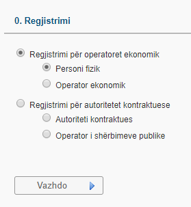

Pas zgjedhjes së kategorisë,shfrytëzuesi duhet ta plotësojë fushën rreth të dhënave te tij.

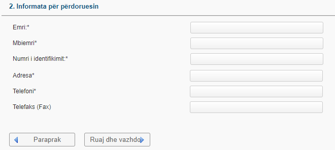

Pasi regjistrimi të bëhet me sukses shfrytëzuesi mund të kyçet dhe mund të ngarkojë filen(dosjen) me të dhënat rreth ofertës së tij. Gjithashtu shfrytëzuesi mund të shikojë historinë e tij.

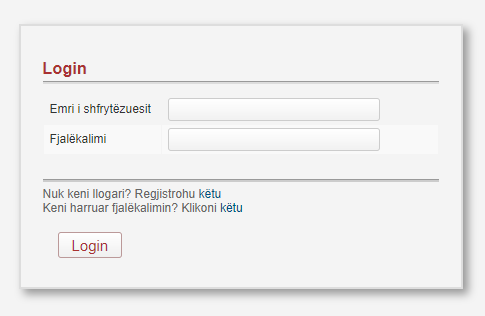

### Pritjet e përdoruesit

- Dobishmëria-web aplikacioni duhet të jete jokompleks,lehtë I manipulueshëm ashtuqë t’i ofrojë shfrytëzuesit një qasje më të lehtë.
- Dokumentacioni-web aplikacioni duhet të shfaqë informacionet e nevojshme për dokumentet që duhen për aplikim.
- Shumëgjuhësia-Bazuar në Kushtetutën e Republikës se Kosovës(Neni 5)-aplikacioni duhet të ofrohet në gjuhën Shqipe dhe Serbe,përveq detyrimeve nga kushtetuta,aplikacioni duhet të ofrohet edhe në gjuhën Angleze.
- Legjislacioni-Sistemi duhet të veprojë në përputhje me ligjet e miratuara të Republikës së Kosovës. Ky sistem mbështetet në legjislacionin për Prokurim dhe në ligjin për mbrojtjen e të dhënave.

### Funksionet e kërkuara nga sistemi

#### Kërkesat funksionale

Funksioni kryesor i sistemit është menaxhimi i formës së aplikimit online për tendere.
Aplikimi duhet të jetë operacioni kryesor i sistemit SIMP ku përfshihet i gjithë procesi i plotësimit të formularëve në formën elektronike si dhe ruajtja e të dhënave në bazën e të dhënave.

1. Vendosja e të dhënave në sistem

Formulari duhet të përmbaj të dhënat për aplikuesin (Emri, adresa e ofertuesit, oferta e të cilit hapet, dokumentacioni ligjor dhe çdo dokument i kërkuar nga autoriteti kontraktues).Softweri nuk duhet të lejoj regjistrimin e aplikuesit në sistem pa plotësuar të gjitha fushat e nevojshme.

2. Deklarimi i Ofertës

Aplikuesi duhet të ketë mundësinë që përmes formularëve përkatës të paraqes ofertën e tij.

3. Ri-aplikimi

Nëse aplikuesi paraqet gabim në ofertë, atëherë sistemi duhet t’i lejoj vetëm një herë të ri-paraqesë ofertën dhe atë jo si ofertë e re por sikur korrigjim e asaj të vjetrës. 

4. Azhurimi (update) i të dhënave

Shfrytëzuesit (aplikuesit) e rinjë duhet të regjistrohen së bashku me të dhënat përkatëse për biznesin dhe të dhëna tjera përcjellëse, të nevojshme për procesin e aplikimit.

5.	Alarmimi në rast gabimi

Sistemi duhet të tregojë gabimet gjatë plotësimit të formularëve (duke mos e lejuar vazhdimin e procedures). Gjithashtu duhet të alarmoj gabimet e mundshme gjatë azhurimit të të dhënave.

6.	Alarmimi në afat aplikimi

Sistemi duhet të tregoj edhe për afatet e aplikimit të cilat aplikuesi i ka për obligim t’i respektoj me Legjislacionin e Prokurimit te Kosoves.

#### Kërkesat jofunksionale

Që të sigurohet operimi normal i sistemit, kërkesat jo-funksionale që duhet të përmbushë SIMP janë:
	
1.	Sistemi duhet të jetë i aftë të pranoj të dhënat nga paisje të ndyshme.

2.	Sistemi duhet të jetë në gjendje online 24 orë në ditë, 7 ditë në javë e 365 ditë në vit.

3.	Identifikimi i gabimeve.

Sistemi duhet të jetë në gjendje të identifikoj gabimet e mundshme gjatë deklarimit të të dhënava si ID jo-boshe, ID duplikate, ID gabim, emrat gabim, kontributet etj.

4.	Sigurimi i konfidencialitetit

Të gjitha komunikimet që duhet të kryhen në SIMP duhet të jenë të enkriptuara në bazë të standarteve ndërkombëtare.

5.	Gjenerimi automatik i numrit identifikues

Sistemi duhet që për çdo aplikim që bëhet për herë të parë të gjeneroj një numër unik dhe atë ta ruaj në bazën e të dhënave.

6.	Ekzekutimi i më shumë se një kërkese (multitasking)

Sistemi duhet të jetë në gjendje të përballoj përpunimin e njëkohshëm te kërkesave nga të gjitha njësitë që e shfrytëzojnë ketë sistem, sepse të dhënat duhet të lidhen me bazën qëndrore të të dhënave, pra me bazën e njejtë të të dhënave. 

7.	Ri-kyçja

Nëse shfryetëzuesi nuk punon në sistem më shumë se 15 minuta ose e harron hapur atëherë sistemi duhet që në mënyrë automatike të shkyçet dhe t’i kërkohet ri-kyçja nëse dëshiron të kyçet në sistem.

8.	Disponueshmëria e sistemit

Sistemi duhet të jetë i disponueshëm edhe gjatë problemeve siç është ndërprerja e furnizimit me energji elektrike.

### Funksionet tjera të kërkuara nga produkti

#### Performanca e sistemit

- Sistemi duhet të përdor dy server ashtu që në rast të dështimit të njërit server,serveri tjetër të jetë në gjendje të procesojë kërkesat
- Sistemi duhet të jetë në gjendje te ristartohet për vetëm 15 sekonda
- Sistemi duhet të ketë dy Database server,një për ruajtjen e shënimeve dhe një për kopjimin e të dhënave ose BACKUP

#### Siguria

- Përdorimi I HTTPS
- Sistemi duhet të ruhet ndaj teknikave të code injection sikurse që është sql injection,xss dhe abuzimeve të privilegjeve të databazës
- Sistemi duhet të përdor SSL gjatë transmetimit të të dhënave

#### Portabiliteti

Sistemi elektronik SIMP duhet të jetë portabil ashtu që mund të përdoret në laptop,kompjuter apo nga paisje të tjera të mençura si telefoni dhe tableti.

#### Besueshmëria

Sistemi duhet të përdor dy server ashtu që në rast të dështimit të njërit server,serveri tjetër të jetë në gjendje të procesojë kërkesat.

#### Mirëmbajtja

Administratori I sistemit duhet të jete në gjendje të menaxhoj dhe konfigurojë sistemin.

#### Ripërdorimi

Ky sistem duhet të jetë në gjendje të jetë I ripërdorueshëm edhe nga shtetet e tjera të cilët ende nuk kanë një sistem të tillë.

#### Përdorueshmëria

Leximi dhe shqyrtimi i aplikimeve bëhet vetëm nga personat të cilët janë të autorizuar për një punë të tillë. Për çdo rast të keqpërdorimit të këtyre të dhënave mundësohet evidentimi i personit përgjegjës në detyrë nëpërmjet mbajtjes së evidencës për punën e stafit.

### Modeli i domenit

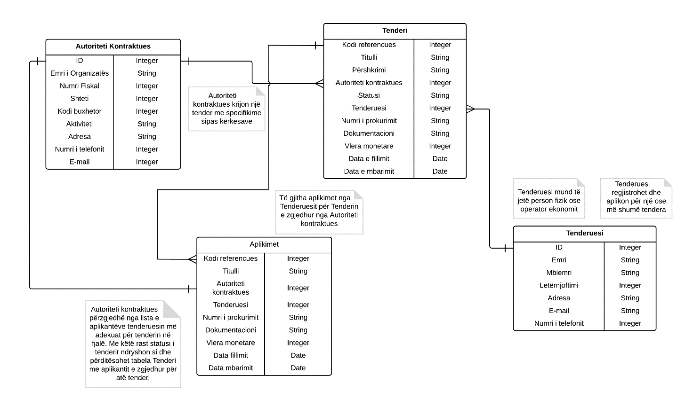

### Skenarët e interaksionit (use case)

#### Përshkrimi për use case 1

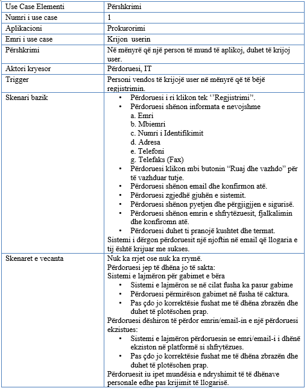

Diagrami për use case 1

Kontratat operacionale për use case 1

<b>Operacioni</b>: Krijimi i user-it (shfrytëzuesit) për regjistrim.  
<b>Referencat</b>: Use Case nr.1, “Prokurorimi”  
<b>Parakushtet</b>: User-i (shfrytëzuesi) duhet të qaset në webfaqe.  
<b>Paskushtet</b>: User-i (shfrytëzuesi) gjatë regjistrimit jep të dhënat valide dhe regjistrohet me sukses. 

Diagrami sekuencial për use case 1

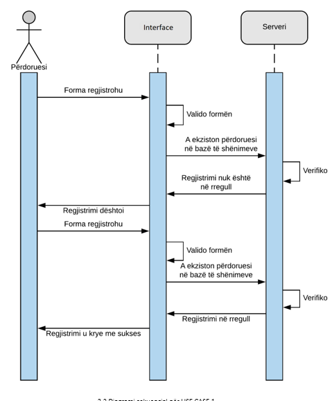

#### Përshkrimi për use case 2

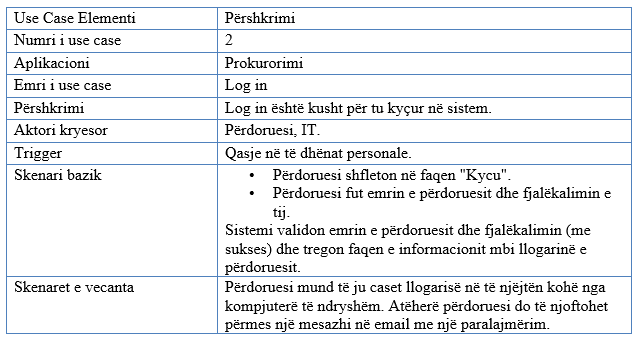

Diagrami për use case 2

Kontratat operacionale për use case 2

<b>Operacioni</b>: Login-i për user-in (shfrytëzuesin)  
<b>Referencat</b>: Use Case nr.2, “Prokurimi"  
<b>Parakushtet</b>: User-i (shfrytëzuesi) duhet të jetë i regjistruar  
<b>Paskushtet</b>: User-i (shfrytëzuesi) kyqet me username dhe fjalëkalimin e tij valid.

Diagrami sekuencial për use case 2

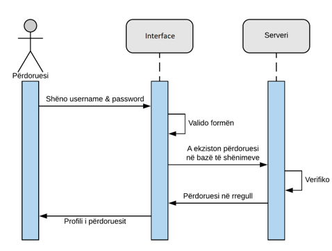

#### Përshkrimi për use case 3

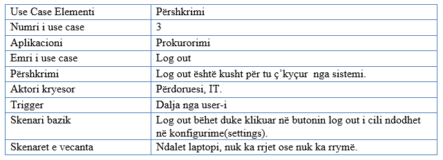

Diagrami për use case 3

Kontratat operacionale për use case 3

<b>Operacioni</b>: Logout i user-it (shfrytëzuesit)  
<b>Referencat</b>: Use Cases nr.3, “Prokurorimi”  
<b>Parakushtet</b>: User-i (shfrytëzuesi) duhet të jetë i kyqur në system  
<b>Paskushtet</b>: User-i (shfrytëzuesi) zgjedhë opsionin logout në sistem. Pasi që shfrytëzuesi të shkqyet nga sistemi, prapë shfaqet user-interface për login në sistem

Diagrami sekuencial për use case 3

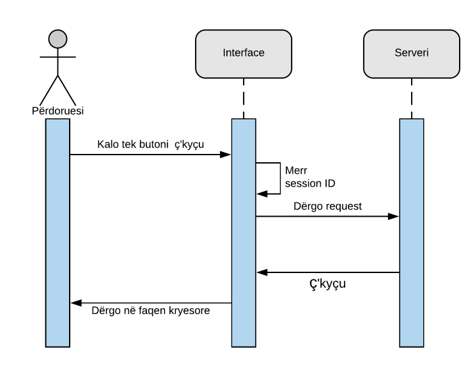

#### Përshkrimi për use case 4

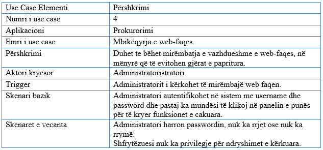

Diagrami për use case 4

Kontratat operacionale për use case 4

<b>Operacioni</b>: Mbikqyrja e webfaqes  
<b>Referencat</b>: Use Case nr.4, “Prokurorimi”  
<b>Parakushtet</b>: Webfaqja duhet të mbikqyret vetëm nga personat e autorizuar  
<b>Paskushtet</b>: Personat e autorizuar (administratori) i kanë privilegjet e nevojshme të cilat nuk mund ti ketë një përdorues i thjeshtë për mbikqyrjen e webfaqes.

Diagrami sekuencial për use case 4

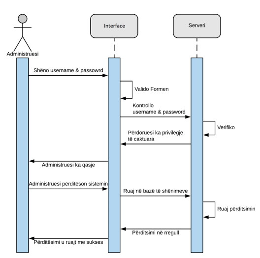

#### Përshkrimi për use case 5

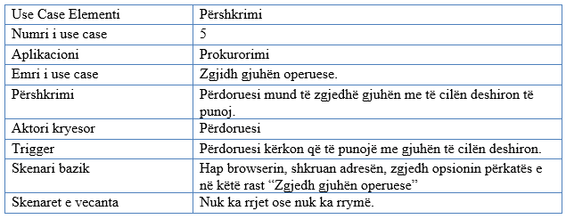

Diagrami për use case 5

Kontratat operacionale për use case 5

<b>Operacioni</b>: Zgjedhja e gjuhës operuese për të punuar  
<b>Referencat</b>: Use Case nr.5, “Prokurorimi”   
<b>Parakushtet</b>: User-i (shfrytëzuesi) duhet të qaset në webfaqe  
<b>Paskushtet</b>: User-i (shfrytëzuesi) të operoj në gjuhën e zgjedhur.

Diagrami sekuencial për use case 5

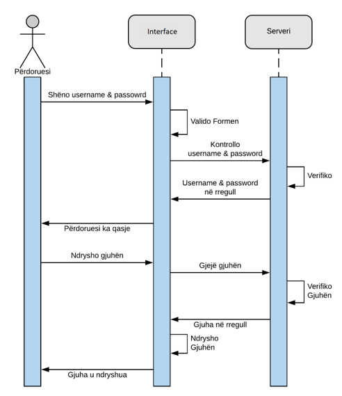

#### Përshkrimi për use case 6

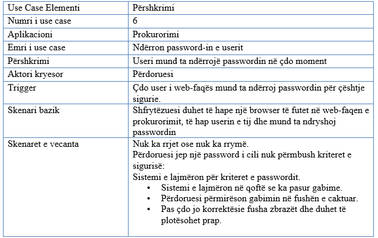

Diagrami për use case 6

Kontratat operacionale për use case 6

<b>Operacioni</b>: Ndryshimi I password-it të user-it (shfrytëzuesit).  
<b>Referencat</b>: Use Case nr.6, “Prokurorimi”  
<b>Parakushtet</b>: User-i (shfrytëzuesi) duhet të ketë llogari aktive.  
<b>Paskushtet</b>: User-i (shfrytëzuesi) të jep të dhëna valide ashtu që e ndërron password-in me sukses.

Diagrami sekuencial për use case 6

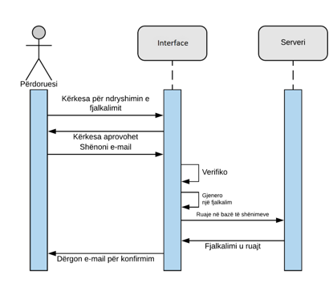

#### Përshkrimi për use case 7

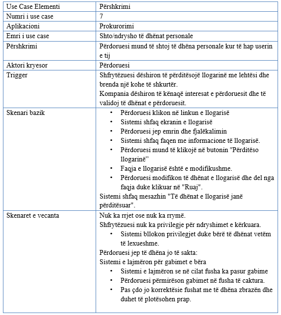

Diagrami për use case 7

Kontratat operacionale për use case 7

<b>Operacioni</b>: Shtimi ose ndryshimi i të dhënave personale.  
<b>Referencat</b>: Use Case nr.7, “Prokurorimi”  
<b>Parakushtet</b>: User-i (shfrytëzuesi) duhet të ketë llogari aktive.  
<b>Paskushtet</b>: User-i (shfrytëzuesi) gjatë ndryshimit jep të dhënat valide dhe ndërron të dhënat e me sukses.

Diagrami sekuencial për use case 7

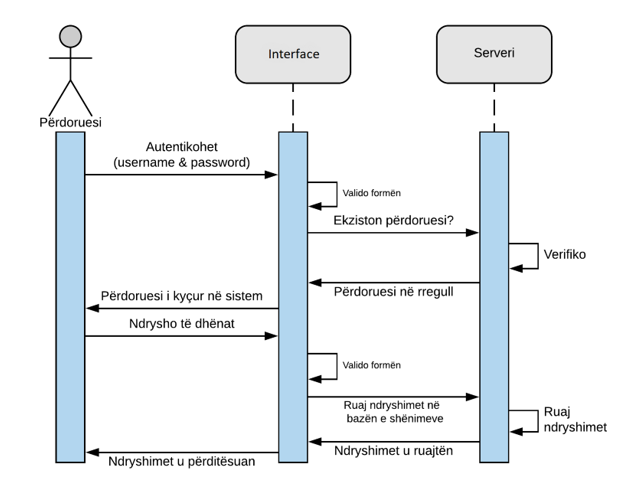

#### Përshkrimi për use case 8

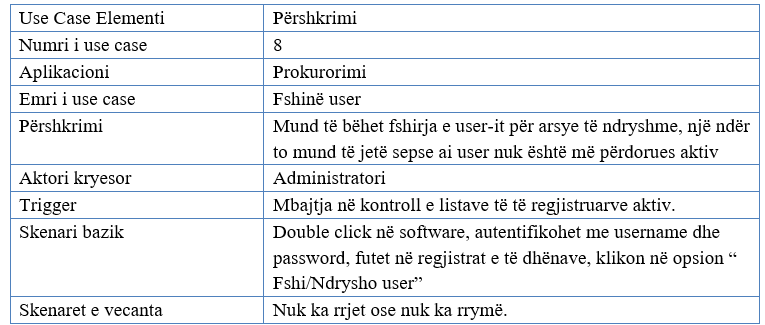

Diagrami për use case 8

Kontratat operacionale për use case 8

<b>Operacioni</b>: Fshirja e user-it (shfrytëzuesit).  
<b>Referencat</b>: Use Case nr.8, “Prokurorimi”  
<b>Parakushtet</b>: User-i (shfrytëzuesi) duhet të ketë llogari jo aktive.  
<b>Paskushtet</b>: Llogaria të mos jetë e aktive dhe e qasshme.

Diagrami sekuencial për use case 8

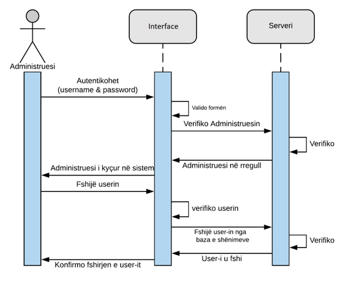

### Kërkesat e klientit për menaxhimin e projektit
Përshkrimi i kërkesave të klientit për menaxhimin e projektit.

### Kërkesat e implementimit

Sistemi duhet të implementohet në një afat kohor prej 3 muajsh.Komponentet të cilat mund të përdoren për funksionim të sistemit janë:
Laptop dhe kompjuterë
Universal Plug System UPS
Dy servera për të dhëna(një Database Server dhe një Web Server)
Një server post elektronik(E-mail Server)
Rrjet kompjuterik
Sistemi operativ (MS Windows 2007 ose 2008,MS Windows 2012 Server)
Sistemi për menaxhimin e bazës së të dhënave(MS Sql Server 2012)
Sistemi për menaxhimin e mesazheve elektronike(MS Outlook 2012)

### Komponentet e gatshme dhe ato të blera

Për konfigurimin e rrjetës preferohet që paisjet e nevojshme për konfugurim të blihen të reja.

### Nënkontraktimi

Për  arsye se ky softuer do të punojë me të dhëna sensitive dhe kërkohet siguri në nivel të lartë nuk lejohet kontraktimi i ndonjë kompanie për zhvillimin e ndonjë komponenteje të sistemit

### Kushtet e pranimit

Softueri duhet të testohet nga një kompani e posaqme që merret me testimin e softuerëve, dhe është i pranueshëm vetëm në rastin e plotësimit të secilës kerkesë të parashtruar nga klienti.

### Kushtet e dorëzimit

Setup-i i softuerit do të ruhet në Database Server dhe si i tillë nuk ka nevoje të shpërndahet në mënyre fizike.

### Garancia

Për paisjet harduerike sistemi duhet të ketë garanicë prej më së shumti 24 muaj ndërsa softueri duhet të jetë vazhdimisht në mbikëqyrje.

## Obligimet e klientit

Obligimi i vetëm i klientit është që të sigurojë harduerin në mënyrë që të ketë qasje në platformën e krijuar si dhe të ketë qasje në rrjet.

### Planifikimi i resurseve

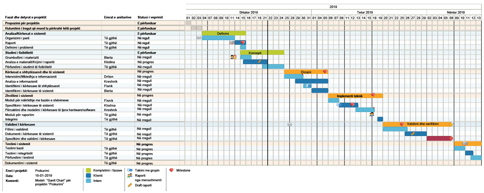

### Planifikimi i buxhetit 

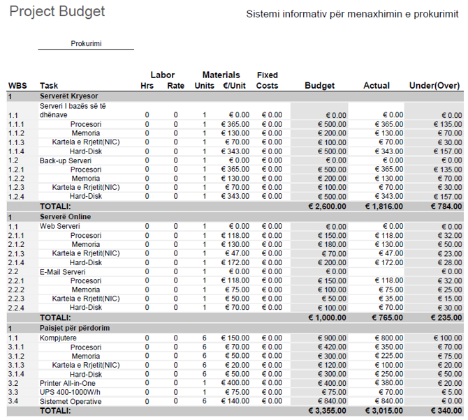
